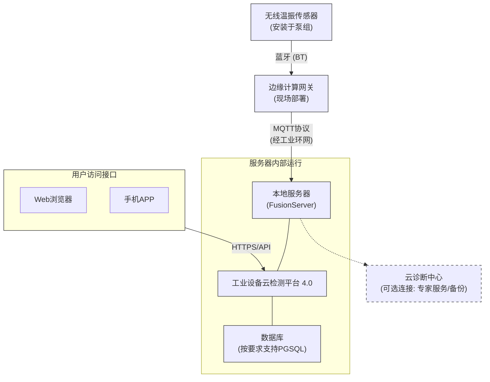

```mermaid
graph TD
    A["无线温振传感器<br/>(安装于泵组)"] -- "蓝牙 (BT)" --> B["边缘计算网关<br/>(现场部署)"];
    B -- "MQTT协议<br/>(经工业环网)" --> C["本地服务器<br/>(FusionServer)"];
    
    subgraph ServerComponents [服务器内部运行]
        direction LR
        C --- D["工业设备云检测平台 4.0"]
        D --- E["数据库<br/>(按要求支持PGSQL)"]
    end

    subgraph UserAccess [用户访问接口]
        direction TB
        F["Web浏览器"]
        G["手机APP"]
    end
    
    UserAccess -- HTTPS/API --> D;
    C -.-> H["云诊断中心<br/>(可选连接: 专家服务/备份)"];

    %% Optional Styling
    style A fill:#lightblue,stroke:#333
    style B fill:#lightgreen,stroke:#333
    style C fill:#lightgrey,stroke:#333
    style D fill:#beige,stroke:#333
    style E fill:#whitesmoke,stroke:#333
    style UserAccess fill:#pink,stroke:#333
    style H fill:#cornsilk,stroke:#333,stroke-dasharray: 5 5
```