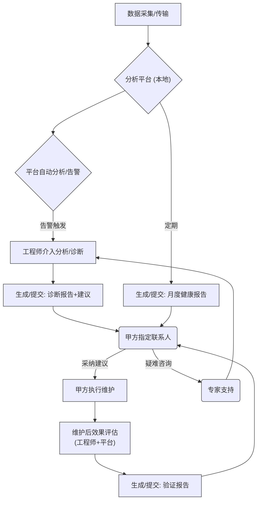

```mermaid
graph TD
    A["数据采集/传输"] --> C{"分析平台 (本地)"};
    C --> D{"平台自动分析/告警"};
    D -- 告警触发 --> F["工程师介入分析/诊断"];
    F --> H["生成/提交: 诊断报告+建议"];
    H --> I(甲方指定联系人);
    I -- 采纳建议 --> J[甲方执行维护];
    J --> K["维护后效果评估<br/>(工程师+平台)"];
    K --> L["生成/提交: 验证报告"];
    L --> I;
    C -- 定期 --> N["生成/提交: 月度健康报告"];
    N --> I;
    I -- 疑难咨询 --> O(专家支持);
    O --> F;
    style A fill:#lightblue,stroke:#333
    style C fill:#lightgreen,stroke:#333
    style D fill:#lightcoral,stroke:#333
    style F fill:#yellow,stroke:#333
    style H fill:#beige,stroke:#333
    style I fill:#pink,stroke:#333
    style J fill:#lightgrey,stroke:#333
    style K fill:#yellow,stroke:#333
    style L fill:#beige,stroke:#333
    style N fill:#beige,stroke:#333
    style O fill:#lightgrey,stroke:#333

```