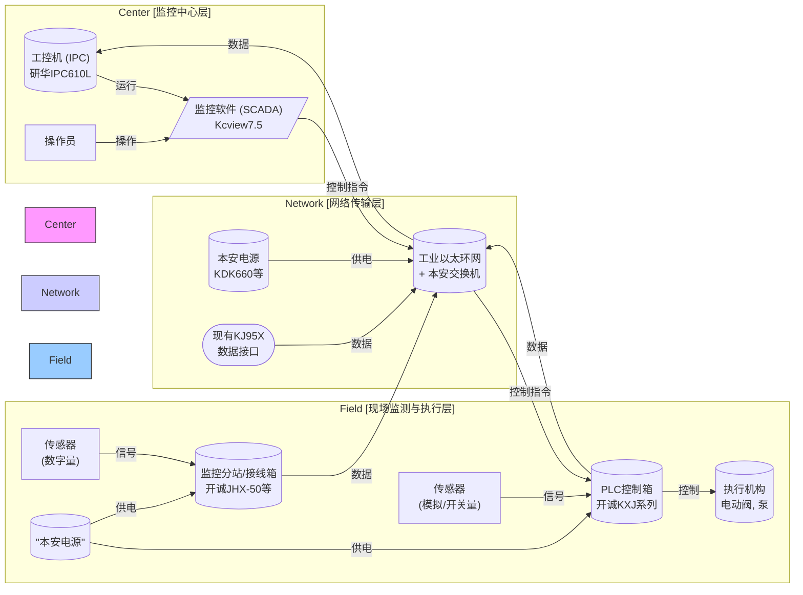

```mermaid
graph LR
    subgraph "Center [监控中心层]"
        IPC[("&quot;工控机 (IPC)<br/>研华IPC610L&quot;")]
        SCADA[/"&quot;监控软件 (SCADA)<br/>Kcview7.5&quot;"/]
        Operator[操作员]
    end

    subgraph "Network [网络传输层]"
        Switch[("&quot;工业以太环网<br/>+ 本安交换机&quot;")]
        PowerNet[("&quot;本安电源<br/>KDK660等&quot;")]
        KJ95X_Data(["&quot;现有KJ95X<br/>数据接口&quot;"])
    end

    subgraph "Field [现场监测与执行层]"
        SensorsA["传感器<br/>(模拟/开关量)"]
        SensorsD["传感器<br/>(数字量)"]
        PLC[("&quot;PLC控制箱<br/>开诚KXJ系列&quot;")]
        Substation[("&quot;监控分站/接线箱<br/>开诚JHX-50等&quot;")]
        Actuators[("&quot;执行机构<br/>电动阀, 泵&quot;")]
        PowerField[("&quot;本安电源&quot;")]
    end

    SensorsA -- 信号 --> PLC
    SensorsD -- 信号 --> Substation
    PLC -- 数据 --> Switch
    Substation -- 数据 --> Switch
    KJ95X_Data -- 数据 --> Switch
    Switch -- 数据 --> IPC

    Operator -- 操作 --> SCADA
    IPC -- 运行 --> SCADA
    SCADA -- 控制指令 --> Switch
    Switch -- 控制指令 --> PLC
    PLC -- 控制 --> Actuators

    PowerField -- 供电 --> PLC
    PowerField -- 供电 --> Substation
    PowerNet -- 供电 --> Switch

    style Center fill:#f9f,stroke:#333,stroke-width:1px
    style Network fill:#ccf,stroke:#333,stroke-width:1px
    style Field fill:#9cf,stroke:#333,stroke-width:1px

```