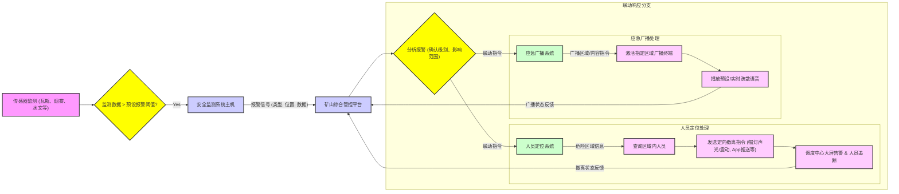

```mermaid
graph LR;

    A["传感器监测 (瓦斯、烟雾、水文等)"]:::sensor --> B{"监测数据 > 预设报警阈值?"}:::decision;
    B -- Yes --> C["安全监测系统主机"]:::process;
    C -- 报警信号 (类型, 位置, 数据) --> D["矿山综合管控平台"]:::process;
    D --> E{"分析报警 (确认级别、影响范围)"}:::decision;

    subgraph "联动响应分支"
        E -- 联动指令 --> F["人员定位系统"]:::system;
        E -- 联动指令 --> G["应急广播系统"]:::system;

        subgraph "人员定位处理"
            direction LR
            F -- 危险区域信息 --> H["查询区域内人员"]:::action;
            H --> I["发送定向撤离指令 (帽灯声光/震动, App推送等)"]:::action;
            I --> L["调度中心大屏告警 & 人员追踪"]:::action;
        end

        subgraph "应急广播处理"
             direction LR
            G -- 广播区域/内容指令 --> J["激活指定区域广播终端"]:::action;
            J --> K["播放预设/实时疏散语音"]:::action;
        end
    end

    L -- 撤离状态反馈 --> D;
    K -- 广播状态反馈 --> D;

    classDef sensor fill:#f9f,stroke:#333,stroke-width:2px;
    classDef decision fill:#ff0,stroke:#333,stroke-width:2px;
    classDef process fill:#ccf,stroke:#333,stroke-width:2px;
    classDef system fill:#cfc,stroke:#333,stroke-width:2px;
    classDef action fill:#fcf,stroke:#333,stroke-width:2px;
    classDef default fill:#fff,stroke:#333,stroke-width:1px;

```