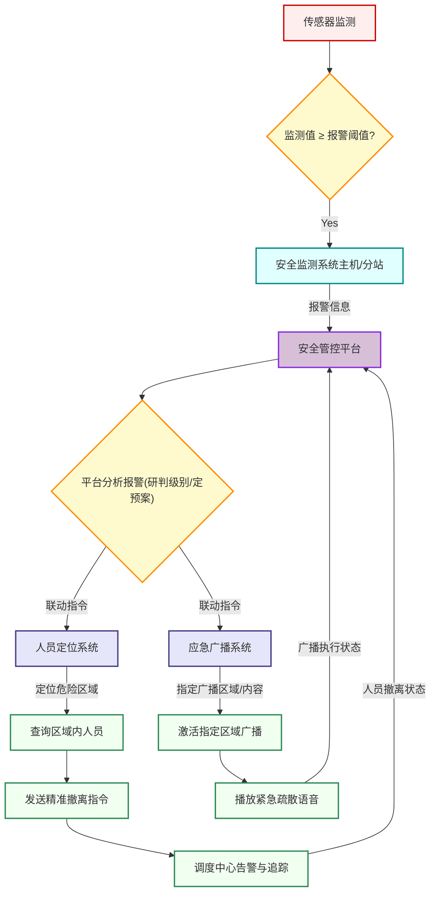

```mermaid
graph TD
    A["传感器监测"]:::sensor --> B{"监测值 ≥ 报警阈值?"}:::decision
    B -- Yes --> C["安全监测系统主机/分站"]:::process
    C -- 报警信息 --> D["安全管控平台"]:::platform
    D --> E{"平台分析报警(研判级别/定预案)"}:::decision
    E -- 联动指令 --> F["人员定位系统"]:::system
    E -- 联动指令 --> G["应急广播系统"]:::system
    F -- 定位危险区域 --> H["查询区域内人员"]:::action
    H --> I["发送精准撤离指令"]:::action
    I --> L["调度中心告警与追踪"]:::action
    G -- 指定广播区域/内容 --> J["激活指定区域广播"]:::action
    J --> K["播放紧急疏散语音"]:::action
    L -- 人员撤离状态 --> D
    K -- 广播执行状态 --> D
    classDef sensor fill:#FFEEEE,stroke:#CC0000,stroke-width:2px
    classDef decision fill:#FFFACD,stroke:#FF8C00,stroke-width:2px
    classDef process fill:#E0FFFF,stroke:#008B8B,stroke-width:2px
    classDef platform fill:#D8BFD8,stroke:#8A2BE2,stroke-width:2px
    classDef system fill:#E6E6FA,stroke:#483D8B,stroke-width:2px
    classDef action fill:#F0FFF0,stroke:#2E8B57,stroke-width:2px
    classDef default fill:#F5F5F5,stroke:#696969,stroke-width:1px

```