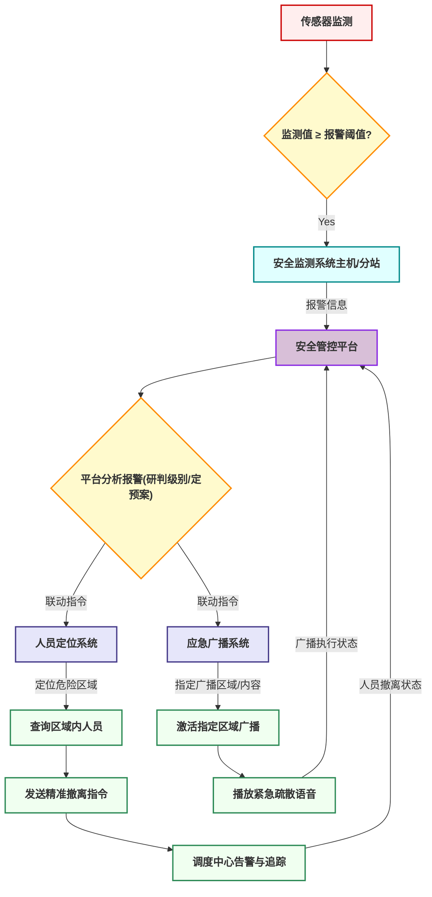

```mermaid
graph TD;
    A["<b>传感器监测</b>"]:::sensor --> B{"<b>监测值 ≥ 报警阈值?</b>"}:::decision;
    B -- Yes --> C["<b>安全监测系统主机/分站</b>"]:::process;
    C -- 报警信息 --> D["<b>安全管控平台</b>"]:::platform;
    D --> E{"<b>平台分析报警(研判级别/定预案)</b>"}:::decision;
    E -- 联动指令 --> F["<b>人员定位系统</b>"]:::system;
    E -- 联动指令 --> G["<b>应急广播系统</b>"]:::system;
    F -- 定位危险区域 --> H["<b>查询区域内人员</b>"]:::action;
    H --> I["<b>发送精准撤离指令</b>"]:::action;
    I --> L["<b>调度中心告警与追踪</b>"]:::action;
    G -- 指定广播区域/内容 --> J["<b>激活指定区域广播</b>"]:::action;
    J --> K["<b>播放紧急疏散语音</b>"]:::action;
    L -- 人员撤离状态 --> D;
    K -- 广播执行状态 --> D;
    classDef sensor fill:#FFEEEE,stroke:#CC0000,stroke-width:2px;
    classDef decision fill:#FFFACD,stroke:#FF8C00,stroke-width:2px;
    classDef process fill:#E0FFFF,stroke:#008B8B,stroke-width:2px;
    classDef platform fill:#D8BFD8,stroke:#8A2BE2,stroke-width:2px;
    classDef system fill:#E6E6FA,stroke:#483D8B,stroke-width:2px;
    classDef action fill:#F0FFF0,stroke:#2E8B57,stroke-width:2px;
    classDef default fill:#F5F5F5,stroke:#696969,stroke-width:1px;
```