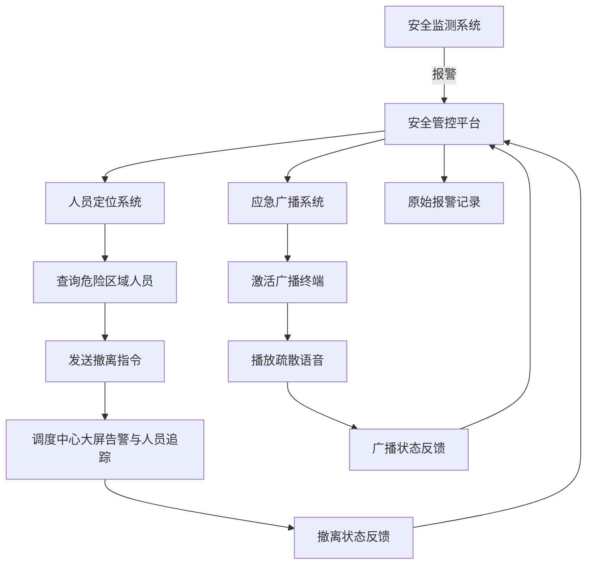

```mermaid
graph TD
    A["安全监测系统"] -->|报警| B["安全管控平台"]
    B --> C["人员定位系统"]
    B --> D["应急广播系统"]
    C --> E["查询危险区域人员"]
    E --> F["发送撤离指令"]
    F --> G["调度中心大屏告警与人员追踪"]
    D --> H["激活广播终端"]
    H --> I["播放疏散语音"]
    G --> J["撤离状态反馈"]
    I --> K["广播状态反馈"]
    J --> B
    K --> B
    B --> L["原始报警记录"]

```