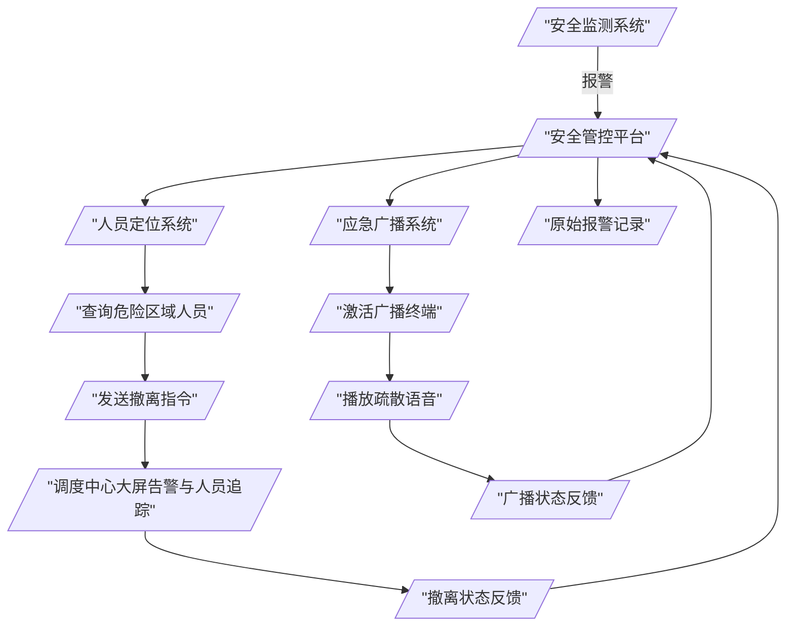

```mermaid
graph TD
    A[/"&quot;安全监测系统&quot;"/] -->|报警| B[/"&quot;安全管控平台&quot;"/]
    B --> C[/"&quot;人员定位系统&quot;"/]
    B --> D[/"&quot;应急广播系统&quot;"/]
    C --> E[/"&quot;查询危险区域人员&quot;"/]
    E --> F[/"&quot;发送撤离指令&quot;"/]
    F --> G[/"&quot;调度中心大屏告警与人员追踪&quot;"/]
    D --> H[/"&quot;激活广播终端&quot;"/]
    H --> I[/"&quot;播放疏散语音&quot;"/]
    G --> J[/"&quot;撤离状态反馈&quot;"/]
    I --> K[/"&quot;广播状态反馈&quot;"/]
    J --> B
    K --> B
    B --> L[/"&quot;原始报警记录&quot;"/]

```