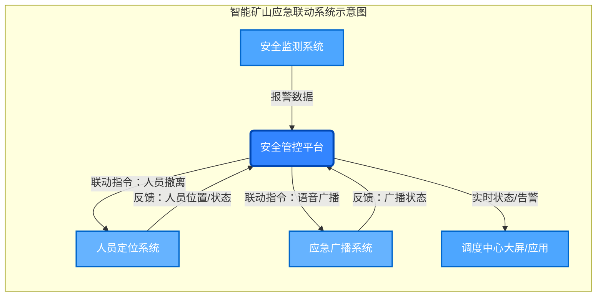

```mermaid
graph LR
    subgraph "智能矿山应急联动系统示意图"
    direction TB

    A[安全监测系统] -->|报警数据| B(安全管控平台)
    C[人员定位系统] -->|"反馈：人员位置/状态"| B
    D[应急广播系统] -->|反馈：广播状态| B
    B -->|联动指令：人员撤离| C
    B -->|联动指令：语音广播| D
    B -->|"实时状态/告警"| E["调度中心大屏/应用"]

    style A fill:#4da6ff,stroke:#0066cc,stroke-width:2,color:white
    style B fill:#3385ff,stroke:#0047b3,stroke-width:3,color:white
    style C fill:#66b3ff,stroke:#0066cc,stroke-width:2,color:white
    style D fill:#66b3ff,stroke:#0066cc,stroke-width:2,color:white
    style E fill:#4da6ff,stroke:#0066cc,stroke-width:2,color:white

    A:::sensor
    B:::platform
    C:::location
    D:::broadcast
    E:::dispatch

    classDef sensor fill:#4da6ff,stroke:#0066cc,stroke-width:2,color:white
    classDef platform fill:#3385ff,stroke:#0047b3,stroke-width:3,color:white
    classDef location fill:#66b3ff,stroke:#0066cc,stroke-width:2,color:white
    classDef broadcast fill:#66b3ff,stroke:#0066cc,stroke-width:2,color:white
    classDef dispatch fill:#4da6ff,stroke:#0066cc,stroke-width:2,color:white

    end

```