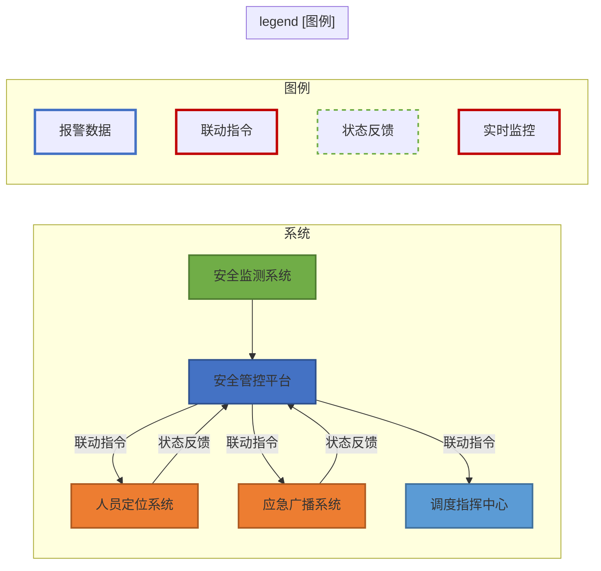

```mermaid
graph LR
    subgraph "系统"
        A[安全监测系统]
        B[安全管控平台]
        C[人员定位系统]
        D[应急广播系统]
        E[调度指挥中心]
    end

    style A fill:#70AD47,stroke:#507E32,stroke-width:2
    style B fill:#4472C4,stroke:#2F528F,stroke-width:2
    style C fill:#ED7D31,stroke:#AE5A21,stroke-width:2
    style D fill:#ED7D31,stroke:#AE5A21,stroke-width:2
    style E fill:#5B9BD5,stroke:#41719C,stroke-width:2

    A --> B
    B -- 联动指令 --> C
    B -- 联动指令 --> D
    C -- 状态反馈 --> B
    D -- 状态反馈 --> B
    B -- 联动指令 --> E

    subgraph "图例"
        F[报警数据]
        G[联动指令]
        H[状态反馈]
        I[实时监控]
    end
    
    style F stroke:#4472C4,stroke-width:3
    style G stroke:#C00000,stroke-width:3
    style H stroke:#70AD47,stroke-width:2,stroke-dasharray:5 5
    style I stroke:#C00000,stroke-width:3

    
    subgraph "legend [图例]"
    end
```