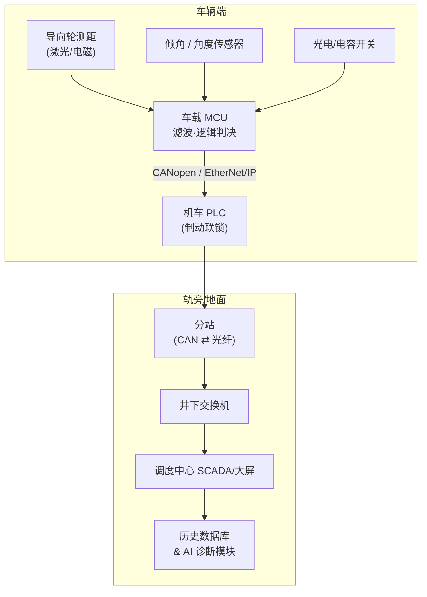

```mermaid
graph TD
    subgraph "车辆端"
        A["导向轮测距<br>(激光/电磁)"]
        B["倾角 / 角度传感器"]
        C["光电/电容开关"]
        A & B & C --> D["车载 MCU<br>滤波·逻辑判决"]
        D -->|"CANopen / EtherNet/IP"| E["机车 PLC<br>(制动联锁)"]
    end

    subgraph "轨旁/地面"
        E --> F["分站<br>(CAN ⇄ 光纤)"]
        F --> G[井下交换机]
        G --> H["调度中心 SCADA/大屏"]
        H --> I["历史数据库<br>& AI 诊断模块"]
    end

```